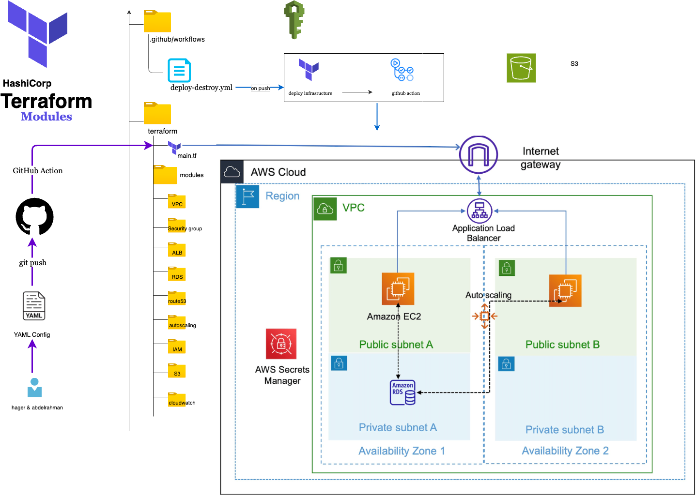

# AutoAWS - Automated AWS Infrastructure Deployment
## Table of Contents
1. [Project Overview](#project-overview)
2. [Architecture Overview](#architecture-overview)
3. [Prerequisites](#prerequisites)
4. [Project Structure](#project-structure)
5. [Module Documentation](#module-documentation)
   - [VPC Module](#vpc-module)
   - [Security Groups Module](#security-groups-module)
   - [S3 Module](#s3-module)
   - [RDS Module](#rds-module)
6. [Configuration Guide](#configuration-guide)
7. [Deployment Process](#deployment-process)
8. [GitHub Actions CI/CD](#github-actions-cicd)
9. [Testing and Validation](#testing-and-validation)


---

## 1. Project Overview

### What is AutoAWS?
AutoAWS is an infrastructure-as-code automation tool that simplifies AWS resource provisioning through YAML configuration files. Instead of writing complex Terraform code for each project, users can define their infrastructure requirements in a simple YAML file and let the automation handle the rest.



### Key Features
- ✅ **YAML-Based Configuration** - Define infrastructure in simple, readable YAML files
- ✅ **Modular Architecture** - Reusable Terraform modules for different AWS services
- ✅ **Automated Deployment** - Python script handles Terraform execution
- ✅ **CI/CD Integration** - GitHub Actions for automatic deployments


### Problem Statement
Traditional infrastructure deployment requires:
- Manual Terraform code writing for each project
- Deep knowledge of Terraform syntax
- Repetitive code for similar infrastructure patterns
- Manual deployment processes
- Risk of human error

### Solution
AutoAWS solves these problems by:
- Providing pre-built, tested Terraform modules
- Abstracting complexity behind simple YAML configs
- Automating the entire deployment process
- Ensuring consistency across deployments
- Enabling team collaboration through version control

---

## 2. Architecture Overview

### System Architecture Diagram
**[INSERT SCREENSHOT: draw.io diagram showing complete system flow]**

### Components
1. **YAML Configuration Files** - User-defined infrastructure specifications
2. **Python Deployment Script** - Orchestrates the deployment process
3. **Terraform Modules** - Reusable infrastructure components
4. **GitHub Actions** - CI/CD automation pipeline
5. **AWS Cloud** - Target infrastructure platform

### Workflow
```
Developer → YAML Config → Python Script → Terraform → AWS Resources
                ↓
         GitHub Actions (Optional)
```

---

## 3. Project Structure

### Directory Layout
```
AutoAWS/
├── configs/                    # YAML configuration files
│   ├── test-vpc.yaml          # Full test configuration
│   └── simple-test.yaml       # Simple test configuration
├── modules/                    # Terraform modules
│   ├── VPC/                   # VPC with subnets, NAT, IGW
│   ├── Security_groups/       # Security group management
│   ├── S3/                    # S3 bucket creation
│   ├── RDS/                   # RDS database instances
│   ├── CloudWatch/            # CloudWatch monitoring
│   ├── ECR/                   # Elastic Container Registry
│   ├── ECS/                   # Elastic Container Service
│   ├── alb/                   # Application Load Balancer
│   ├── autoscaling/           # Auto Scaling groups
│   └── IAM/                   # IAM roles and policies
├── scripts/                    # Automation scripts
│   └── deploy.py              # Main deployment script
├── .github/workflows/          # GitHub Actions workflows
│   └── deploy-infrastructure.yml
├── main.tf                     # Root Terraform configuration
├── variables.tf                # Root variable definitions
├── outputs.tf                  # Root output definitions
├── providers.tf                # Provider configurations
├── .gitignore                 # Git ignore rules
└── README.md                   # Project documentation

```

### File Purposes
- **configs/** - Store all infrastructure definitions as YAML
- **modules/** - Reusable Terraform components for AWS services
- **scripts/** - Python automation scripts
- **.github/workflows/** - CI/CD pipeline definitions
- **Root TF files** - Terraform entry points that call modules

---

## 5. Module Documentation

### VPC Module

#### Purpose
Creates a complete Virtual Private Cloud infrastructure including:
- VPC with custom CIDR block
- Public and private subnets across multiple availability zones
- Internet Gateway for public subnet internet access
- NAT Gateways for private subnet outbound connectivity
- Route tables with proper routing configuration
- DNS resolution and hostname support


#### Configuration Example
Simple YAML configuration that creates VPC with subnets:
```yaml
enable_vpc: true
vpc_cidr: "10.0.0.0/16"
enable_nat_gateway: true
single_nat_gateway: false
public_subnets:
  - name: "public-web-1"
    cidr_block: "10.0.1.0/24"
    availability_zone: "us-east-1a"
private_subnets:
  - name: "private-app-1"
    cidr_block: "10.0.10.0/24"
    availability_zone: "us-east-1a"
```


#### Network Architecture


---

### Security Groups Module

#### Purpose
Manages AWS Security Groups which act as virtual firewalls controlling inbound and outbound traffic to AWS resources. This module provides a flexible way to define security rules through YAML configuration.

#### Key Features
- **Flexible Rule Definition** - Define ingress and egress rules via YAML
- **CIDR-Based Rules** - Allow traffic from specific IP ranges
- **Security Group References** - Allow traffic between security groups
- **Default Egress** - Automatically allows all outbound traffic if no egress rules specified
- **Multiple Security Groups** - Create and manage multiple security groups per configuration
- **Rule Descriptions** - Add descriptions for audit and documentation

#### Configuration Example
Define web, application, and database tier security groups:
```yaml
enable_security_groups: true
security_groups:
  - name: "web-sg"
    description: "Security group for web servers"
    ingress_rules:
      - description: "HTTPS from internet"
        from_port: 443
        to_port: 443
        protocol: "tcp"
        cidr_blocks: ["0.0.0.0/0"]
  
  - name: "app-sg"
    description: "Security group for application servers"
    ingress_rules:
      - description: "HTTP from web tier"
        from_port: 8080
        to_port: 8080
        protocol: "tcp"
        security_groups: ["web-sg"]
```


#### Security Architecture


---

### S3 Module

#### Purpose
Creates and manages AWS S3 buckets with comprehensive configuration options including versioning, encryption, lifecycle policies, and CORS settings. S3 is AWS's object storage service used for storing files, backups, static websites, and application data.

#### Configuration Example
Create buckets for different purposes:
```yaml
enable_s3: true
s3_buckets:
  - name: "app-assets"
    versioning_enabled: true
    encryption_enabled: true
    public_read_access: false
    lifecycle_rules_enabled: true
    lifecycle_rules:
      - id: "archive-old-data"
        enabled: true
        transition_to_ia_days: 30
        transition_to_glacier_days: 90
        expiration_days: 365
```

#### S3 Architecture

---

### RDS Module

#### Purpose
Creates and manages AWS RDS (Relational Database Service) instances with support for multiple database engines, high availability, automated backups, and monitoring. RDS provides managed database services eliminating the need for manual database administration.

#### Configuration Example
Create a MySQL database with high availability:
```yaml
enable_rds: true
rds_instances:
  - name: "app-db"
    engine: "mysql"
    engine_version: "8.0"
    instance_class: "db.t3.micro"
    allocated_storage: 20
    max_allocated_storage: 100
    username: "admin"
    db_name: "application"
    multi_az: true
    backup_retention_period: 7
    monitoring_enabled: true
    deletion_protection: true
```
---

## 6. Configuration Guide

### YAML Configuration File Structure

#### Basic Configuration
Every YAML file must contain these essential fields:
```yaml
project_name: "my-project"      # Required: Project identifier
environment: "dev"              # Required: Environment name
aws_region: "us-east-1"         # Required: AWS region
```

#### Common Tags
Define tags applied to all resources:
```yaml
common_tags:
  Owner: "DevOps-Team"
  Environment: "development"
  Project: "AutoAWS"
  ManagedBy: "terraform"
  CostCenter: "Engineering"
```

#### Module Enablement
Control which modules to deploy:
```yaml
enable_vpc: true
enable_security_groups: true
enable_s3: true
enable_rds: false
enable_cloudwatch: false
```
---

## 7. Deployment Process

### Manual Deployment (Using Python Script)

#### Step 1: Prepare Configuration

1. Create or edit YAML configuration file in `configs/` directory
2. Validate YAML syntax
3. Review configuration for correctness

#### Step 2: Set AWS Credentials

```bash
# Configure AWS credentials
aws configure

# Verify credentials
aws sts get-caller-identity
```

#### Step 3: Run Deployment Script

```bash
# Navigate to project directory
cd AutoAWS

# Run deployment
python scripts/deploy.py configs/test-vpc.yaml
```

#### Step 4: Review Terraform Plan

The script will:
1. Generate `terraform.tfvars` from YAML
2. Run `terraform init`
3. Run `terraform plan`
4. Display resources to be created/modified/destroyed

#### Step 5: Confirm and Apply

- Review the plan carefully
- Type "yes" to proceed
- Wait for deployment to complete

```

#### Common Issues and Solutions

**Issue 1: AWS Credentials Not Found**
```
Error: No valid credential sources found
```
Solution: Run `aws configure` and enter credentials

**Issue 2: Insufficient Permissions**
```
Error: AccessDenied: User is not authorized
```
Solution: Ensure IAM user has required permissions (EC2, VPC, RDS, S3)

**Issue 3: CIDR Overlap**
```
Error: The CIDR 10.0.0.0/16 conflicts with existing CIDR
```
Solution: Choose different CIDR block in YAML configuration


---

## 8. GitHub Actions CI/CD

### Overview
GitHub Actions provides automated deployment triggered by code changes, eliminating manual deployment steps and ensuring consistency across environments.


### Workflow Architecture

#### Trigger Events
1. **Push to main branch** - Automatic deploy to production
2. **Push to develop branch** - Plan only, no apply
3. **Pull Request** - Validate and plan, comment on PR
4. **Manual Trigger** - workflow_dispatch for on-demand deployment

#### Job Flow
```
Validate → Plan → Apply → Notify
   ↓         ↓       ↓       ↓
 Pass?    Save    Deploy  Success?
          Plan   Resources
```

### Setup Process

#### Step 1: Add AWS Credentials to GitHub Secrets
**[INSERT SCREENSHOT: GitHub Settings → Secrets page]**

1. Navigate to repository Settings
2. Go to Secrets and variables → Actions
3. Click "New repository secret"
4. Add:
   - Name: `AWS_ACCESS_KEY_ID`
   - Value: Your AWS access key
5. Repeat for `AWS_SECRET_ACCESS_KEY`

**[INSERT SCREENSHOT: Adding secret in GitHub]**

#### Step 2: Create Workflow File
**[INSERT SCREENSHOT: Workflow file in VS Code]**

File location: `.github/workflows/deploy-infrastructure.yml`

The workflow file defines:
- When to run (triggers)
- What jobs to execute
- Environment variables
- Required secrets

#### Step 3: Enable GitHub Actions
**[INSERT SCREENSHOT: Actions tab in GitHub]**

1. Go to Actions tab in repository
2. Locate "Deploy AWS Infrastructure" workflow
3. Workflow is automatically enabled

#### Step 4: Configure Environments (Optional)
**[INSERT SCREENSHOT: GitHub Environments settings]**

1. Go to Settings → Environments
2. Create "production" environment
3. Add protection rules:
   - Required reviewers
   - Wait timer
   - Deployment branches

### Using GitHub Actions

#### Automatic Deployment (Push to main)
**[INSERT SCREENSHOT: Git push command]**
**[INSERT SCREENSHOT: GitHub Actions automatically triggered]**

```bash
# Make changes to config
vim configs/prod-vpc.yaml

# Commit and push
git add configs/prod-vpc.yaml
git commit -m "Update production VPC configuration"
git push origin main

# GitHub Actions automatically starts
```

#### Manual Deployment
**[INSERT SCREENSHOT: Manual workflow dispatch UI]**

1. Go to Actions tab
2. Select "Deploy AWS Infrastructure"
3. Click "Run workflow"
4. Choose:
   - Branch (main/develop)
   - Config file path
   - Action (plan/apply/destroy)
5. Click "Run workflow"

**[INSERT SCREENSHOT: Workflow running]**

### Workflow Jobs Explained

#### Job 1: Validate
**[INSERT SCREENSHOT: Validate job logs]**

Purpose: Quick validation before expensive operations
- Checks YAML syntax
- Verifies Terraform files exist
- Runs in ~30 seconds
- Fails fast on basic errors

#### Job 2: Plan

#### Job 3: Apply
**[INSERT SCREENSHOT: Apply job success]**

Purpose: Deploy infrastructure
- Only runs on main branch
- Requires environment approval
- Downloads plan artifact
- Applies changes
- Saves outputs as artifact

#### Job 4: Destroy
**[INSERT SCREENSHOT: Destroy job confirmation]**

Purpose: Remove infrastructure
- Only runs on manual trigger with "destroy" action
- Requires "production-destroy" environment approval
- Destroys all resources
- Use with extreme caution

### Viewing Results

#### Workflow Run Details
**[INSERT SCREENSHOT: Workflow run summary]**

Click on workflow run to see:
- Job status (success/failure)
- Execution time
- Logs for each step
- Artifacts generated

#### Artifacts
**[INSERT SCREENSHOT: Artifacts section]**

Generated artifacts:
- **terraform-plan**: Execution plan (5 days retention)
- **terraform-outputs**: Resource details (30 days retention)

Download artifacts to review offline

#### Pull Request Comments
**[INSERT SCREENSHOT: Terraform plan in PR comments]**

For PR triggers:
- Plan output commented on PR
- Team can review before merge
- Approve/reject based on plan

