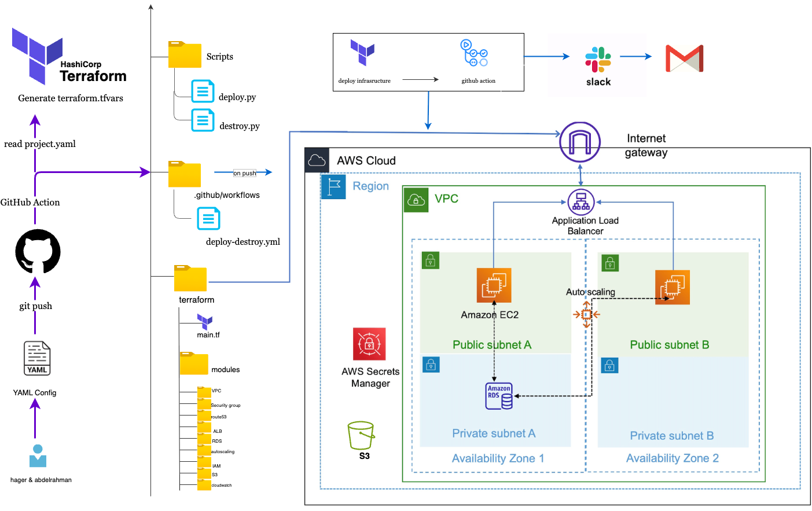

# AutoAWS - Automated AWS Infrastructure Deployment

AutoAWS is an infrastructure-as-code automation that simplifies AWS resource provisioning through YAML configuration files. Instead of writing complex Terraform code for each project, users can define their infrastructure requirements in a simple YAML file and let the automation handle the rest.

## 1. System Architecture Diagram



### Components
1. **YAML Configuration Files** - User-defined infrastructure specifications
2. **Python Deployment Script** - Orchestrates the deployment process
3. **Terraform Modules** - Reusable infrastructure components
4. **GitHub Actions** - CI/CD automation pipeline
5. **AWS Cloud** - Target infrastructure platform

### Problem Statement
Traditional infrastructure deployment requires:
- Manual Terraform code writing for each project
- Deep knowledge of Terraform syntax
- Repetitive code for similar infrastructure patterns
- Manual deployment processes
- Risk of human error

### Solution
AutoAWS solves these problems by:
- Providing pre-built, tested Terraform modules
- Abstracting complexity behind simple YAML configs
- Automating the entire deployment process
- Ensuring consistency across deployments
- Enabling team collaboration through version control

---

## 2. Project Structure

### Directory Layout
```
AutoAWS/
├── configs/                   
│   └── example-project.yaml    
├── modules/                    
│   ├── VPC/                   
│   ├── Security_groups/      
│   ├── S3/                     
│   ├── RDS/                     
│   ├── CloudWatch/             
│   ├── secrerts/                    
│   ├── route53/
│   ├── alb/                                          
│   ├── autoscaling/            
│   └── IAM/                     
├── scripts/                   
│   └── deploy.py               
│   └── destroy.py              
│   └── infra.py                 
├── .github/workflows/           
│   └── deploy-destroy.yml
├── backend.tf
├── main.tf                      
├── variables.tf                
├── outputs.tf                 
├── providers.tf                 
├── .gitignore                   
└── README.md                    

```
### File Purposes
- **configs/** - Store all infrastructure definitions as YAML
- **modules/** - Reusable Terraform components for AWS services
- **scripts/** - Python automation scripts
- **.github/workflows/** - CI/CD pipeline definitions
- **Root TF files** - Terraform entry points that call modules

---
## 3. Configuration Guide

### YAML Configuration File Structure

#### Basic Configuration
Every YAML file must contain these essential fields:
```yaml
project_name: "my-project"      # Required: Project identifier
environment: "dev"              # Required: Environment name
aws_region: "us-east-1"         # Required: AWS region
```

#### Common Tags
Define tags applied to all resources:
```yaml
common_tags:
  Owner: "DevOps-Team"
  Environment: "development"
  Project: "AutoAWS"
  ManagedBy: "terraform"
  CostCenter: "Engineering"
```

#### Module Enablement
Control which modules to deploy:
```yaml
enable_vpc: true
enable_security_groups: true
enable_s3: true
enable_rds: false
enable_cloudwatch: false
```
---

## 4. Deployment Process

### Manual Deployment (Using Python Script)

#### Step 1: Prepare Configuration

1. Create or edit YAML configuration file in `configs/` directory
2. Validate YAML syntax
3. Review configuration for correctness

#### Step 2: Set AWS Credentials

```bash
# Configure AWS credentials
aws configure

```

#### Step 3: Run Deployment Script

```bash
# Navigate to project directory
cd AutoAWS

# Run deployment
python scripts/deploy.py configs/test-vpc.yaml
```

#### Step 4: Review Terraform Plan

The script will:
1. Generate `terraform.tfvars` from YAML
2. Run `terraform init`
3. Run `terraform plan`
4. Display resources to be created/modified/destroyed

#### Step 5: Confirm and Apply

- Review the plan carefully
- Type "yes" to proceed
- Wait for deployment to complete


---
## 5. Module Documentation

### VPC Module
**Purpose:**  
Creates a custom Virtual Private Cloud (VPC) with public and private subnets, route tables, and gateways.  
It provides the base networking layer for all AWS resources.  

**Features:**  
- Public & private subnets  
- Internet Gateway  
- NAT Gateway  
- Route tables and associations 


#### Configuration Example
Simple example YAML configuration that creates VPC with subnets:
```yaml
enable_vpc: true
vpc_cidr: "10.0.0.0/16"
enable_nat_gateway: true
single_nat_gateway: false
public_subnets:
  - name: "public-web-1"
    cidr_block: "10.0.1.0/24"
    availability_zone: "us-east-1a"
private_subnets:
  - name: "private-app-1"
    cidr_block: "10.0.10.0/24"
    availability_zone: "us-east-1a"
```

---

### Security Groups Module
**Purpose:**  
Manages inbound and outbound traffic rules for AWS resources.  
You can easily define all rules from YAML without writing Terraform manually.  

**Features:**  
- Ingress & egress rules  
- CIDR or SG-based rules  
- Tiered application design (web, app, DB) 

#### Configuration Example
Define web, application, and database tier security groups:
```yaml
services:
  security_groups:
    - name: alb
      description: "ALB security group"
      ingress_rules:
        - from_port: 80
          to_port: 80
          protocol: tcp
          cidr_blocks: ["0.0.0.0/0"]
          description: "Allow HTTP from anywhere"
      egress_rules: []
      
    - name: app
      description: "App server SG"
      ingress_rules:
        - from_port: 8080
          to_port: 8080
          protocol: tcp
          cidr_blocks: ["10.0.0.0/16"] 
```
---

### S3 Module
**Purpose:**  
Creates secure S3 buckets for data storage, backups, or static website hosting.  

**Features:**  
- Versioning & encryption  
- Lifecycle rules  
- Access control policies  

#### Configuration Example
Create buckets for different purposes:
```yaml
enable_s3: true
s3_buckets:
  - name: "app-assets"
    versioning_enabled: true
    encryption_enabled: true
    public_read_access: false
    lifecycle_rules_enabled: true
    lifecycle_rules:
      - id: "archive-old-data"
        enabled: true
        transition_to_ia_days: 30
        transition_to_glacier_days: 90
        expiration_days: 365
```
---

### RDS Module
**Purpose:**  
Creates managed relational databases (MySQL, PostgreSQL, etc.) with automated backups and monitoring.  

**Features:**  
- Multi-AZ support  
- Backup retention  
- Encryption and monitoring  

#### Configuration Example
Create a MySQL database with high availability:
```yaml
enable_rds: true
rds_instances:
  - name: "app-db"
    engine: "mysql"
    engine_version: "8.0"
    instance_class: "db.t3.micro"
    allocated_storage: 20
    max_allocated_storage: 100
    username: "admin"
    db_name: "application"
    multi_az: true
    backup_retention_period: 7
    monitoring_enabled: true
    deletion_protection: true
```
---
### ALB Module
**Purpose:**  
Creates an Application Load Balancer to distribute traffic across multiple EC2 instances or containers.  

**Features:**  
- HTTP/HTTPS listeners  
- Target groups and health checks  
- Integration with Auto Scaling and ECS  

---
### IAM Module  
**Purpose:**  
Creates AWS IAM roles, users, and policies to manage access control securely.  

**Features:**  
- IAM roles with custom policies  
- Attach roles to EC2 or services  
- Principle of least privilege  

---

### Route53 Module  
**Purpose:**  
Manages DNS records for your domains, allowing you to route traffic easily to ALB, EC2, or CloudFront.  

**Features:**  
- Public/Private hosted zones  
- A/AAAA/CNAME records  
- ALB and EC2 integration  

---
### Secrets Manager Module  
**Purpose:**  
Stores and manages secrets (like passwords or API keys) securely and retrieves them dynamically.  

**Features:**  
- Encrypted secret storage  
- Automatic rotation  
- Secure access from applications  

---

### CloudWatch Module  
**Purpose:**  
Provides monitoring and logging for AWS resources.  
Helps track performance metrics and send alerts when thresholds are exceeded.  

**Features:**  
- CloudWatch alarms  
- Metrics and dashboards  
- Log groups for EC2, Lambda, or RDS  

---

### Auto Scaling Module  
**Purpose:**  
Automatically adjusts the number of EC2 instances based on workload and performance metrics.  

**Features:**  
- Scale in/out policies  
- Integration with ALB  
- CloudWatch metric triggers  

---
### Root Module Integration

- Conditional module execution with count and try()

- Full YAML-to-terraform.tfvars mapping

- Correct module.vpc[0].vpc_id indexing fix

- Added dependency chaining (ALB → ASG → RDS → SG)
---

## 6. Python Automation Scripts

We created 3 scripts in evolution stages:

### 1. [`deploy.py`](scripts/deploy.py)

**Goal:** Automate basic Terraform deployment
**Features:**

- Read YAML config

- Generate terraform.tfvars

- Run Terraform init/plan/apply


### 1. [`destroy.py`](scripts/destroy.py)

**Goal:** Add cleanup capability
**Features:**

- Same logic as deploy, but calls terraform destroy

- Includes confirmation prompt

- Independent run support


### 1. [`infra.py`](scripts/infra.py)


**Goal**: Replace both deploy/destroy with a single intelligent script.

```bash
python3 scripts/infra.py config/example-project.yaml deploy
python3 scripts/infra.py config/example-project.yaml destroy
```
**Features:**

- Accepts two arguments: config_file and action

- Generates terraform.tfvars dynamically

- Runs Terraform init, plan, and apply/destroy

- Detects invalid configs or keys

- Auto-handles non-interactive mode for CI/CD

- Built-in UTF-8 fix for Terraform JSON compatibility

- Adds safe services parsing for nested structures

---

## 7. GitHub Actions CI/CD Workflow


### Workflow Overview

This workflow automates infrastructure provisioning and destruction using Terraform + Python scripts.

It runs when:

- A YAML file under the config/ directory is pushed

- Or manually through the “Run workflow” button in GitHub

### Workflow File Path

```bash
.github/workflows/deploy-destroy.yml
```

### Workflow Breakdown

```bash
name: Infra CI/CD
```
This defines the name of your workflow as it appears in the GitHub Actions UI.

---- 

### Trigger Section

```yaml
on:
  push:
    paths:
       - 'configs/*.yaml'
  workflow_dispatch:
    inputs:
      action:
        description: "Choose action: deploy or destroy"
        required: true
        default: "deploy"
        type: choice
        options:
          - deploy
          - destroy
      config_file:
        description: "YAML config file"
        required: true
        default: "configs/example-project.yaml"
      confirm_destroy:
        description: "Type Yes to confirm destroy"
        required: false
        default: "No"
```

#### What This Does:

**1. push event**

- Whenever you push a YAML file (like config/example-project.yaml), the workflow automatically runs.

- This is how you get auto-deployment from GitHub → AWS.

**2. workflow_dispatch (manual trigger)**

- Lets you run the pipeline manually from the GitHub Actions UI.

- It includes 3 parameters:

  - action → either deploy or destroy

  - config_file → which YAML file to use

  - confirm_destroy → safety confirmation before destruction

--- 
### Job Definition

```bash
jobs:
  infra:
    runs-on: ubuntu-latest
```
Defines a single job named infra that runs on an Ubuntu virtual machine.

---

### Steps Explanation

Let’s go line-by-line through the workflow steps:

---

#### 1. Checkout Code

```bash
- name: Checkout code
  uses: actions/checkout@v3
```
This step pulls your repository code (Terraform, scripts, and configs) into the runner so it can execute the scripts locally.

---

#### 2. Set Up Python

```bash
- name: Set up Python
  uses: actions/setup-python@v4
  with:
    python-version: '3.10'
```
This installs Python 3.10 inside the runner.
It’s required for running your infra.py script, which automates Terraform.

---

#### 3. Install Dependencies

```bash
- name: Install dependencies
  run: pip install pyyaml boto3 requests
```
Installs the necessary Python libraries:

- PyYAML → to parse the YAML configuration

- Boto3 → for AWS SDK integration (optional)

- Requests → for Slack and email notifications


#### 4. Set Up Terraform

```bash
- name: Set up Terraform
  uses: hashicorp/setup-terraform@v2
  with:
    terraform_version: 1.5.6
```

This installs Terraform version 1.5.6 on the runner.
It ensures that your infrastructure is deployed using the same Terraform version everywhere.

---

#### 5. Run Infra Script

```bash
- name: Run Infra Script
  run: |
    if [[ "${{ github.event_name }}" == "push" ]]; then
      echo "Auto deploy on push"
      python3 scripts/infra.py ${{ github.event.inputs.config_file }} deploy 
    else
      if [[ "${{ github.event.inputs.action }}" == "destroy" ]]; then
        if [[ "${{ github.event.inputs.confirm_destroy }}" != "YES" ]]; then
          echo "Destroy not confirmed. Exiting."
          exit 1
        fi
      fi
      python3 scripts/infra.py ${{ github.event.inputs.config_file }} ${{ github.event.inputs.action }}
    fi
  env:
    AWS_ACCESS_KEY_ID: ${{ secrets.AWS_ACCESS_KEY_ID }}
    AWS_SECRET_ACCESS_KEY: ${{ secrets.AWS_SECRET_ACCESS_KEY }}
    AWS_DEFAULT_REGION: ${{ secrets.AWS_DEFAULT_REGION }}
```
---

### Step Logic Breakdown

| **Condition**                     | **Action**                  | **Explanation**                              |
|----------------------------------|-----------------------------|----------------------------------------------|
| If push event                    | Runs `infra.py ... deploy`  | Auto-deploys whenever a config file is pushed |
| If manual trigger with destroy   | Checks `confirm_destroy == "YES"` | Prevents accidental resource deletion         |
| If manual trigger with deploy    | Runs `infra.py ... deploy`  | Manually triggers infrastructure deployment   |

---

### Environment Variables

These are set securely via **GitHub Secrets**:

| **Secret Name**           | **Description**           |
|----------------------------|---------------------------|
| `AWS_ACCESS_KEY_ID`        | AWS IAM access key        |
| `AWS_SECRET_ACCESS_KEY`    | AWS IAM secret            |
| `AWS_DEFAULT_REGION`       | Default AWS region        |

You configure them under:  
**Repository → Settings → Secrets and Variables → Actions**

---

### Slack & Email Notifications
After Terraform deployment or destruction, AutoAWS automatically notifies the team via Slack and Email.

This ensures instant visibility into the result of each infrastructure change — whether it’s a success or a failure.


#### Slack Success Notification
```bash
- name: Slack Success
  if: success()
  uses: slackapi/slack-github-action@v1.24.0
  with:
    payload: |
      {
        "text": ":white_check_mark: Infra *${{ github.event.inputs.action || 'deploy' }}* SUCCESS for config: *${{ github.event.inputs.config_file || 'configs/example.yaml' }}*"
      }
  env:
    SLACK_WEBHOOK_URL: ${{ secrets.SLACK_WEBHOOK_URL }}
```

**Explanation:**

- if: success() → triggers only if the previous Terraform steps were successful

- payload → JSON payload containing the Slack message content

- SLACK_WEBHOOK_URL → stored securely in GitHub Secrets

- Automatically includes the:

  - Action type (deploy or destroy)

  - Config file name
---
#### Slack Failure Notification

```bash
- name: Slack Failure
  if: failure()
  uses: slackapi/slack-github-action@v1.24.0
  with:
    payload: |
      {
        "text": ":x: Infra *${{ github.event.inputs.action || 'deploy' }}* FAILED for config: *${{ github.event.inputs.config_file || 'configs/example.yaml' }}*"
      }
  env:
    SLACK_WEBHOOK_URL: ${{ secrets.SLACK_WEBHOOK_URL }}
```

**Explanation:**

- if: failure() → triggers only when Terraform or Python scripts fail

- Sends an alert to the Slack channel with failure details
---

#### Setting Up Slack Webhook

1. Go to your Slack Workspace → App Directory

2. Search for Incoming Webhooks

3. Create a new Webhook for your desired channel

4. Copy the Webhook URL

5. Add it in GitHub →
Settings → Secrets and variables → Actions → New repository secret

---

### Email Notifications

We also integrated email notifications using dawidd6/action-send-mail.

This allows the pipeline to send emails on both success and failure via Gmail SMTP (or any mail server).

### Email Success or Failure Notification

```bash
- name: Email Success
  if: success()
  uses: dawidd6/action-send-mail@v3
  with:
    server_address: smtp.gmail.com
    server_port: 465
    username: ${{ secrets.EMAIL_USER }}
    password: ${{ secrets.EMAIL_PASS }}
    subject: "Infra ${{ github.event.inputs.action || 'deploy' }} SUCCESS"
    to: "abdelrahmankhalid27@gmail.com"
    from: "Terraform Bot <${{ secrets.EMAIL_USER }}>"
    body: "Infra ${{ github.event.inputs.action || 'deploy' }} succeeded for config: ${{ github.event.inputs.config_file || 'configs/example.yaml' }}. Commit: ${{ github.sha }}"

- name: Email Success
  if: success()
  uses: dawidd6/action-send-mail@v3
  with:
    server_address: smtp.gmail.com
    server_port: 465
    username: ${{ secrets.EMAIL_USER }}
    password: ${{ secrets.EMAIL_PASS }}
    subject: "Infra ${{ github.event.inputs.action || 'deploy' }} SUCCESS"
    to: "abdelrahmankhalid27@gmail.com"
    from: "Terraform Bot <${{ secrets.EMAIL_USER }}>"
    body: "Infra ${{ github.event.inputs.action || 'deploy' }} succeeded for config: ${{ github.event.inputs.config_file || 'configs/example.yaml' }}. Commit: ${{ github.sha }}"
```

**Note:**
For Gmail, enable App Passwords (not your main account password).
Go to: Google Account → Security → App passwords

